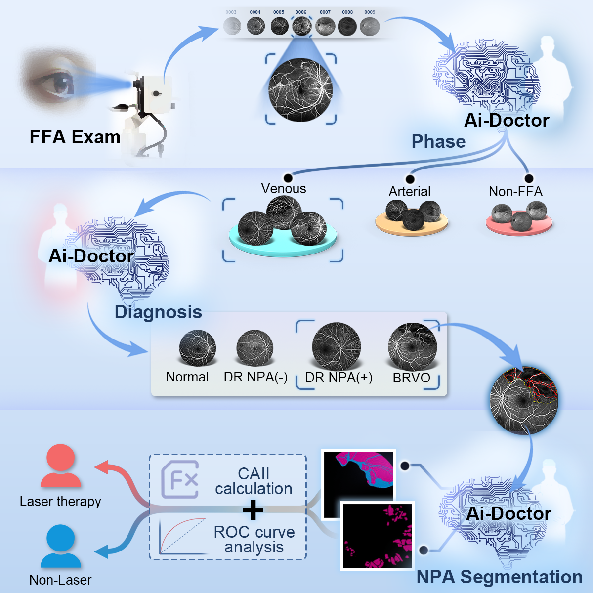
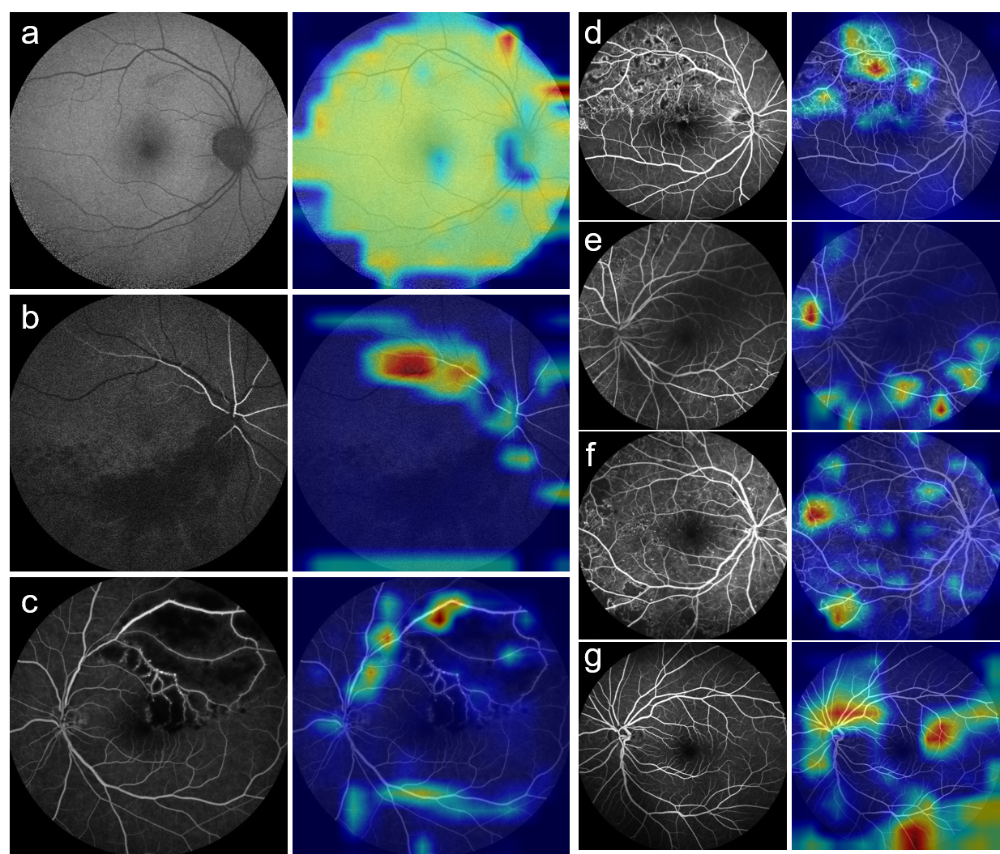
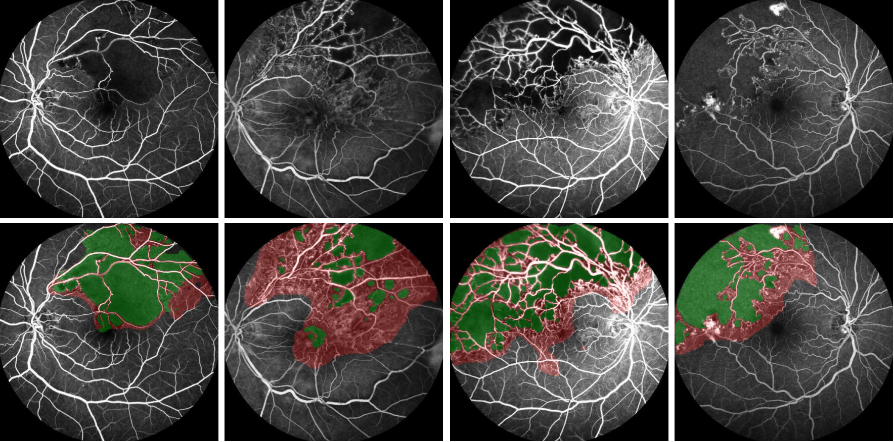

# FFA
[](https://zenodo.org/doi/10.5281/zenodo.11212583)

**A deep learning-based fundus fluoresceinangiography imageanalytics protocowith classification and segmentation tasks**
<p align="center">
     
</p>

## Getting Started

### Requirements

* **Ubuntu 18.04 or higher, Windows 10 or higher with Anaconda or Miniconda**
* **Python 3.7**
* **PyTorch = 1.11.0**
* **tensorflow-gpu = 1.14.0**
* **CUDA 11.3**
* **More packages please refer to [requirement.txt](https://github.com/huapu4/FFA/blob/main/requirement.txt)**

### Installation

a. Create a conda virtual environment and activate it, e.g.,

```
conda create --name [your_name] python=3.7
conda activate [your_name]
```

b. Clone the FFA repository.

```
git clone https://github.com/huapu4/FFA.git
cd FFA
```

c. Install the environments.

```python 
pip install -r requirement.txt
```

### Data preparation

**There will be three datasets to be prepared, respectively in
folder: [01.Phase_identification](https://github.com/huapu4/FFA/tree/main/01.Phase_identification/dataset)
, [02.Disease_diagnosis](https://github.com/huapu4/FFA/tree/main/02.Disease_diagnosis/dataset)
[03.Area_segmentation](https://github.com/huapu4/FFA/tree/main/03.Area_segmentation/FFA_dataset).**

a. Put your own data in [./origin_data](https://github.com/huapu4/FFA/tree/main/origin_data), stored according to
specifications.

```
cd origin_data
tree -d -L 2
.
├── 01.phase_identification
│   ├── arterial_phase
│   ├── non_ffa
│   └── venous_phase
├── 02.disease_diagnosis
│   ├── brvo
│   ├── none_np
│   ├── normal
│   └── with_np
└── 03.area_segmentation
    ├── labeled_data
    └── voc_data
```

b. For [01.Phase_identification](https://github.com/huapu4/FFA/tree/main/01.Phase_identification/dataset)
and [02.Disease_diagnosis](https://github.com/huapu4/FFA/tree/main/02.Disease_diagnosis/dataset), they are
classification
task, with the same data deployment.

```
cd FFA
python cls_data_deploy.py --task [name_of_task] --input [origin_data_folder] --output [output_folder] --prop [proportion of trainset]
```

c. For [03.Area_segmentation](https://github.com/huapu4/FFA/tree/main/03.Area_segmentation/FFA_dataset), it is a
segmentation task, please run.

```
python seg_data_deploy.py --input [VOC_data_folder] --output [output_folder] --prop [proportion of trainset]
```

### Training and validtion

#### [01.Phase_identification](https://github.com/huapu4/FFA/tree/main/01.Phase_identification/dataset) & [02.Disease_diagnosis](https://github.com/huapu4/FFA/tree/main/02.Disease_diagnosis/dataset)

a. before training, augments and hyperparameters in [config.py] as follows:

```
--train_data_root     Train set path.
--test_data_root      Test set path.
--exter_data_root     external test set path (if has).
--batch_size          the learning amount of each batch.
--test_batch_size     the testing amount of each batch.
--num_workers         how many workers for loading data.
--resize_value        set the image icls_3ut size.
--train_log           the path of train log in tensorboard record.
--test_log            the path of test log in tensorboard record.
--max_epoch           the maximun epoch in this task.
--lr = 0.001          learning rate.
# if you have mutiple gpu devices, so you may set under two param.
--device_ids          select which devices， e.g. gpu0,gpu1,gpu4->[0,1,4].
--pri_device          select the primary GPU number.
```

b. begin training

```
cd 01.Phase_identification
python train.py
#----------- or -----------
cd 02.Disease_diagnosis
python train.py
```

c. validation

```
python validation.py --dataset [path of validset] --model [path of *.pth] --excel [name of excel] --roc [name of roc_image]
```

#### [03.Area_segmentation](https://github.com/huapu4/FFA/tree/main/03.Area_segmentation/FFA_dataset)

a. parameters are as follows:

```
--model               Choose the semantic segmentation methods.
--base_model          Choose the backbone model.
--dataset             The path of the dataset.
--loss                The loss function for traing.
--num_classes         The number of classes to be segmented.
--random_crop         Whether to randomly crop the image.
--crop_height         The height to crop the image.
--crop_width          The width to crop the image.
--batch_size          The training batch size.
--valid_batch_size    The validation batch size.
--num_epochs          The number of epochs to train for.
--h_flip              Whether to randomly flip the image horizontally.
--v_flip              Whether to randomly flip the image vertically.
--brightness          Randomly change the brightness (list).
--rotation            The angle to randomly rotate the image.
--zoom_range          The times for zooming the image.
--channel_shift       The channel shift range.
--data_aug_rate       The rate of data augmentation.
--checkpoint_freq     How often to save a checkpoint.
--validation_freq     How often to perform validation.
--num_valid_images    The number of images used for validation.
--data_shuffle        Whether to shuffle the data.
--random_seed         The random shuffle seed.
--weights             The path of weights to be loaded.
--steps_per_epoch     The training steps of each epoch.
--lr_scheduler        The strategy to schedule learning rate.
--lr_warmup           Whether to use lr warm up.
--learning_rate       The initial learning rate.
--optimizer           The optimizer for training.
```

b. start training (All parameters except the selected model are set to default values. Please adjust them as required)

```
cd 03.Area_segmentation
python train.py --model [segmentation head network] --base_model [backbone]
```

c. validation

```
python test.py --model [segmentation head network] --base_model [backbone] --weights [path of *.h5] --dataset [path of validset]
```

### visualization

#### [01.Phase_identification](https://github.com/huapu4/FFA/tree/main/01.Phase_identification/dataset) & [02.Disease_diagnosis](https://github.com/huapu4/FFA/tree/main/02.Disease_diagnosis/dataset)

The visualization for these two tasks is the heatmap.

```
cd 01.Phase_identification
python heatmap --input [folder of data] --model [path of *.pth]
#----------- or -----------
cd 02.Disease_diagnosis
python heatmap --input [folder of data] --model [path of *.pth]
```

<p align="center">
     
</p>

#### [03.Area_segmentation](https://github.com/huapu4/FFA/tree/main/03.Area_segmentation/FFA_dataset)

```
cd 03.Area_segmentation
python visiualization.py --model [segmentation head network] --base_model [backbone] --weights [path of *.h5] --dataset [path of validset]
```

<p align="center">
     
</p>

### Credit

* [Pytorch Torchvision](https://pytorch.org/)
* [Tensorflow](https://www.tensorflow.org/?hl=zh-cn)
* [Opencv-python](https://opencv.org/)
* [Matplotlib](https://matplotlib.org/stable/)
* [Numpy](https://numpy.org/)
* [Scikit-learn](https://scikit-learn.org/)
* [Amazing-Semantic-Segmentation](https://github.com/luyanger1799/Amazing-Semantic-Segmentation)
